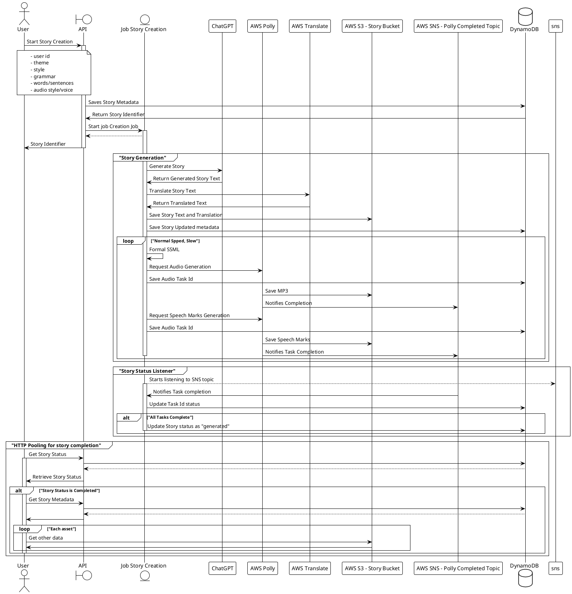

# Story Generation Workflow

[Check diagram online](http://www.plantuml.com/plantuml/png/fLHFS_ic4BtpAROw_pmv-EP39d_Ifkd46K_bJCzOR6mQ12gidFhR5rOOcpZfvNSIOX-FjsztkGaaFOsz4R_G3dk4mKXjXUp8UNWDw4466EDNRDnebVG7k5qzfKqvQ86MD1sW-SDje2KNW_SU9MbdcmJvsst44EbrfmTf2UvtaXvNwnJQ3bI5cjk_MbWvOmvySaYhIy3QInkC96GG7VykWUqSPbdHtTYz8_61CFy2-T96ADyCzwuV318gMBj1TzCP6pWeb2IvaG6XUJXOsRk7EuuhjH5298TWTfrCWGMqoTFQ4BPKxoKX6sTTNBWzUlRs1-_DU0rQnHNN8du37KpwRhtiU-dZwiDv5Qu2MaBROOWxSbJQJSYhlTCT2hGAqWqYqaPLIMCK9VSOigWbaapvY1Z9iXVm9zBeRKOygLJRDuq-awHYvipIikG5iVObDwvuYiuoQJxCcIqkgHLMheYjT-C0pOHxH8j-QgQ9ypfrpUAuZnETY7j7UJc5Wb3vnZN-Io9pdBfcSMgdSro9VsOjQ5KJXZcRUqu2qggCvmGID1UYmhuEYldwOps4SIuQyE9yBmsqmu3g1xJ6VHGBMD5lETukd_C-3qoI-i-8WU2MUw8uU2aW8zOolCU223vU9RDSpSjk6O85l3WkNSYpKhWl5BG3OhU3fVJluMU4L4J_guWfpcGfhDgIfoBPomlkjBhXKdFJ6E1P1qfwi-NJPRdr0nYEQhi5SlnuK7egwWauYYlrgZLsMMFjHcw6enCGM8sG9ZrKnl1-iHsRhuvo6laWo03DzZW8pMStqAep7ueHlw_NArWvPrA2Ryv3OCgJukRygKkpI71ktic713j_VuHINpyBF5zUunvh9iwyhem-vQ--4rBUjkykh-xEy_QhZ1qcGq0wqORvnEfe5pUOCSnF1qitAQnphfszYSknD_y1)

